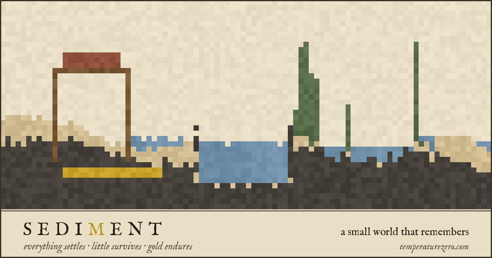

# SEDIMENT

**Live at [demo.temperaturezero.com/sediment](https://demo.temperaturezero.com/sediment/)**

A small falling-sand world that remembers what you do to it. Sand slumps, water
finds its level, stone wears away where the pond touches it, and fire takes
whatever is green. Plants sown on the shore grow, branch, flower and throw their
own seed, and every living cell carries a one-byte genome, so over tens of
in-game days the strains around each pool drift apart into different plants. A
chronicle in the margin records what happened and when. The world is yours and
it persists: close the tab, come back next week, and it has kept going from where
you left it.



## What a visitor does

The page is one folio: a 160 by 100 cell world drawn on vellum, the chronicle
beside it, and a bench of materials below.

- **Sand, Water, Stone** shape the ground. **Seed** scatters a handful of
  grains, each with its own genome. **Fire** burns growth fast and timber
  slowly. **Timber** and **Brick** are for building, and stand only if they are
  held up. **Erase** clears.
- **Gold Leaf** is the one permanent thing. Fire, water and time leave it
  untouched, and there are exactly 400 grains of it per world, ever.
- **Time** cycles x1, x3, x8 and x32. The top speed exists because inheritance
  is not watchable at x8: a strain needs tens of days to drift anywhere.
- **Preserve** saves on demand. The world also saves itself.

Nobody tells you what to do. The motto is the brief: *everything settles, little
survives, gold endures*.

## How it works

### The simulation

The world is a set of flat typed arrays (material, age, stalk height, genome)
over 16,000 cells, stepped bottom-up one tick at a time (one tick per animation
frame at x1) with the scan direction flipping every tick so nothing drifts to one side. A per-cell frame
stamp stops anything moving twice in a tick. There are fourteen materials:
empty, stone, sand, water, seed, plant, flower, root, fire, ember, ash, gold,
timber and brick.

Most of the work is in making each rule hold up over hundreds of days rather
than for a minute:

- **Water** looks up to eight cells along its surface for somewhere to drain and
  steps toward it, rather than sidestepping at random, which is what makes a
  pond settle level instead of shivering in place.
- **Structural support** is a flood fill out from real anchors. Asking each
  built cell only whether a neighbour is solid lets a floating span prop itself
  up for ever; flooding from the ground means a lintel braced on a pillar holds
  and falls the moment the pillar goes. It is recomputed only when something
  is actually hanging over a gap.
- **Plants** carry their height explicitly, die back from the tip so a tree
  retreats downward rather than unzipping from the middle, and put down roots
  that carry water outward, losing a cell of reach per step. Old growth hardens
  into heartwood at the base, and heartwood eventually rots back to ash.
- **Matter has to leave.** A forest turns everything it grows into ash, so ash
  slowly weathers away, and a root gives back exactly the material it
  displaced. Without that the world silted up or, worse, turned its own leavings
  into permanent ground; both failures were measured before they were fixed,
  and the tunables at the top of the script carry notes on what each value
  replaced and why.

### The genome

Every living cell carries one byte: four traits of two bits each. They set how
tall the strain grows, how readily it branches, how far from water it will live,
and which of four tints it is drawn in (moss, olive, verdigris or pine, with
flowers in rose, saffron, woad or madder). The genome is inherited through
germination, growth, branching, flowering and roots. It can slip in only one
place, when a flower sets seed: an 18% chance that one trait moves one notch, so a
lineage walks in a direction rather than jittering. Tint has no order, so it
jumps instead.

Traits are read through 256-entry lookup tables built at boot, so the hot loop
pays a single array index for any of them.

The tint does nothing at all. It is there so a lineage is something you can
watch spreading rather than a number in a save file.

**Water reach is the trait everything turns on, and it only works because being
out of reach is fatal.** A plant holds only ground it can drink on; past its own
reach, a tip withers far faster than age would take it. Gating germination alone
was tried first and did the opposite of what it should: the frontier is a sliver
of a stand, so a few tolerant seedlings at the edge were swamped by gene flow
from the shore and the whole population drifted *toward* thirst. Every trait is
also paid for. Height and branching cost cells of reach, and reach costs growth
rate, because a free trait fixes at its maximum and stays there: before the
costs, every region ran to the tallest, thickest genome going and the world
became a wall of green. With them, tall thickets crowd the water and low, slow
scrub holds the dry ground between the two pools.

Distance to water is a Chebyshev flood fill from every pool and every wet root,
rebuilt every 24 ticks and shared by the whole world. It replaced a per-seed box
scan and costs less than what it replaced. Only a real body of water feeds it: a
cell counts as pool only with at least four water neighbours, because a forest
silts up its own ponds and a film one cell deep spread over ninety columns is not
something to live on.

Once an in-game day, a census reads the mean of each trait in each third of the
world against a baseline taken after the world has settled, and the chronicle
says so when a region's strain has moved: *A strain in the west learned to live
further from water.* When two regions' reach has drifted far enough apart, it
notes that they are no longer the same plant.

### Persistence

Each visitor gets their own world in `localStorage`. The grid, the genome and a
small channel recording which timber grew rather than being built are each
run-length encoded, so even a grown-in forest is a few kilobytes. The world
autosaves every 20 seconds when something has changed, and whenever the tab is
hidden.

The save format is versioned, but new channels are read by presence rather than
by version number, so worlds saved before the genome existed still open: their
growth comes back as the wild type, in the moss green they were drawn in.

Storage failure is handled rather than assumed away. A write probe at boot
catches browsers where `localStorage` exists but throws (some private modes),
shows a note that the vault is unreachable, and lets the piece run without
saving. Preserve then says plainly that nothing was kept. A corrupt save is
decoded into scratch buffers first, so it can cost the visitor a world but never
leave a half-restored one or break the page.

All storage lives in `saveWorld()`, `loadWorld()` and the one probe in `boot()`.

### Mobile

Painting uses pointer events with pointer capture and `touch-action: none`, so a
finger draws the same way a mouse does without scrolling the page. The canvas
scales to the viewport with pixelated rendering, the chronicle stacks under it on
narrow screens, and on a phone the motto moves under the title instead of being
squeezed into a sliver beside it. The end-to-end suite checks all of this at
phone size, including that the page never scrolls sideways.

### One file, no dependencies

What ships is `src/index.html`, with its CSS and script inline, plus two
self-hosted IM Fell English font files and a share image. There is no framework,
no bundler and no runtime dependency; the page makes no third-party requests.
`build.mjs` only copies those files into `build/`, and alongside them writes
`build/test-build.html`, an instrumented copy with a `window.__sediment` hook
injected just before the script's closing IIFE so tests can reach the
simulation's internals. That hook is never in the shipped file.

### Testing it

Playwright drives everything in headless Chromium.

- **`qa/harness.mjs`** tests behaviour against the instrumented build. It calls
  `step()` directly instead of waiting on `requestAnimationFrame`, so thousands
  of ticks cost milliseconds. It covers every material rule, structural support,
  the ecology over hundreds of days, inheritance and mutation rate, whether
  selection actually puts a different strain on the dry ground, save
  compatibility, and a performance budget: one second of Time x8 on a grown-in
  world must compute in under a second. Flame spread, germination and erosion
  are stochastic, so checks that depend on them average over repeated trials; a
  single roll proves nothing.
- **`qa/e2e.mjs`** tests the production build with no hooks: persistence across
  reload, touch painting and layout at phone size, the blocked-storage path,
  fonts, page metadata and a clean console. Pointed at a URL, it runs the same
  checks against the live site.
- **`qa/probe.mjs`** runs the world headless for a few hundred days and lays the
  canvas out as a labelled contact sheet, with each region's population and
  trait census under every frame. Counts hide things a picture shows in a
  second; a bug where every stalk hung floating in mid-air was invisible in the
  tallies. Balance is the real work here, and population swings hard from run
  to run, so it is worth looking at a contact sheet before believing a number.
- **`qa/make-og.mjs`** and **`qa/make-thumb.mjs`** compose the share card and the
  portfolio thumbnail from a real playthrough, not a mockup.

## Running locally

You need Node. Playwright is needed only for the QA scripts.

```bash
node build.mjs                      # writes build/ and build/test-build.html
npx serve build                     # or any static server, then open the page
```

```bash
npm i playwright && npx playwright install chromium   # once, for qa/

node qa/harness.mjs                 # behaviour checks (pass words to filter: water fire)
node qa/e2e.mjs                     # end-to-end against the local build
SEDIMENT_URL=https://demo.temperaturezero.com/sediment node qa/e2e.mjs   # ...or the live site
node qa/probe.mjs                   # contact sheet: --days, --frames, --out, --genesis
```

### Deploying

`deploy.sh` builds, then copies the production files into a directory a web
server already serves. It writes only inside that directory and removes any stray
`test-build.html` it finds there. The target is not stored in the repository:

```bash
SEDIMENT_DEPLOY_TARGET=/path/to/docroot/sediment ./deploy.sh
```

or put `SEDIMENT_DEPLOY_TARGET=...` in a `deploy.env` file beside the script,
which is gitignored. An exported variable takes precedence over the file.

## Project layout

```
src/index.html           the piece: markup, styles and simulation in one file
src/index.original.html  an earlier version, kept for reference; not built
fonts/                   IM Fell English, regular and italic, self-hosted (OFL.txt)
assets/og.png            share card, composed from a real playthrough
assets/showcase-sediment.webp   portfolio thumbnail
build.mjs                assembles build/ and the instrumented test copy
deploy.sh                build and publish to $SEDIMENT_DEPLOY_TARGET
qa/harness.mjs           behaviour, genome, ecology and performance checks
qa/e2e.mjs               persistence, mobile, storage failure, metadata
qa/probe.mjs             headless run laid out as a contact sheet
qa/make-og.mjs           regenerates assets/og.png
qa/make-thumb.mjs        regenerates assets/showcase-sediment.webp
```

## License

Copyright 2026 Maxim Starkweather. All rights reserved. The source is public so
you can read how it works; it is not licensed for reuse or redistribution.

IM Fell English is by Igino Marini and is used under the SIL Open Font License
1.1 (see `fonts/OFL.txt`).
